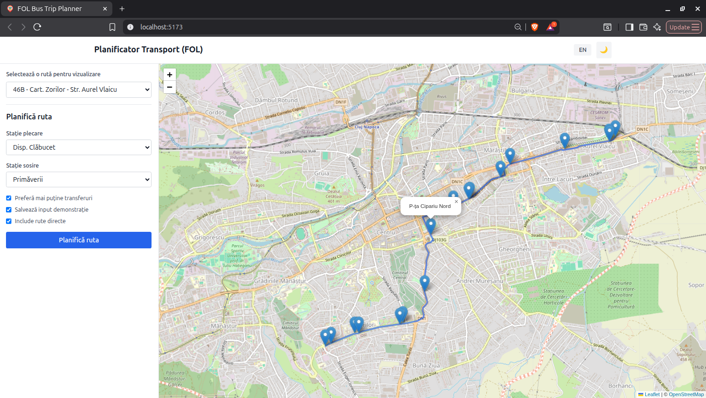
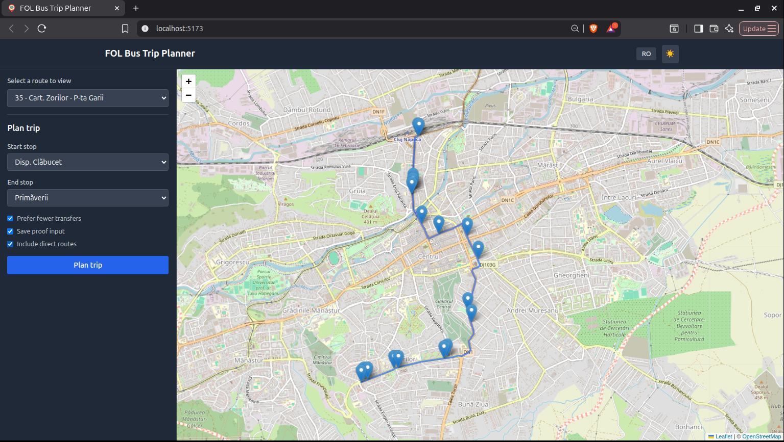
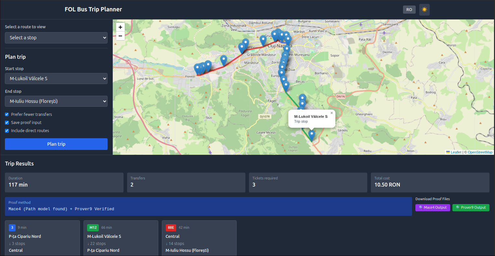
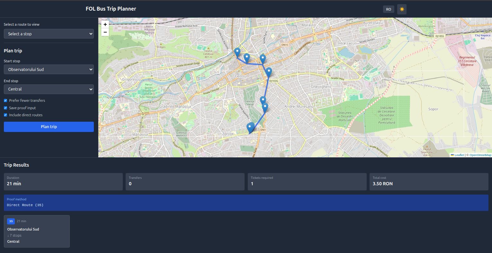
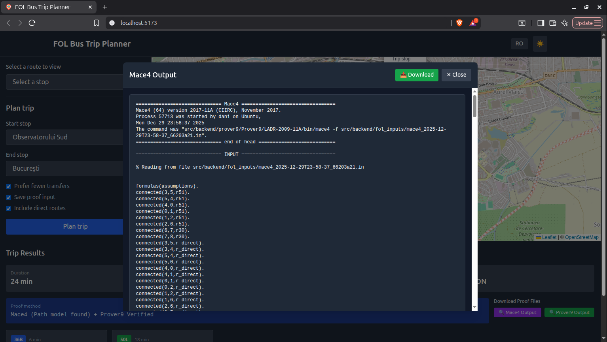
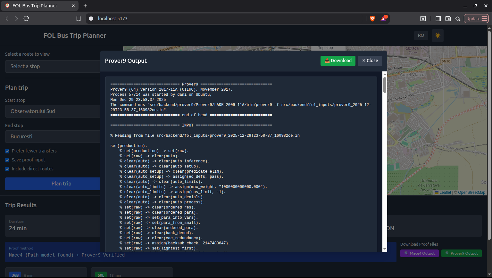

# FOL Bus Trip Planner 🚌

An intelligent bus trip planning system for Cluj-Napoca, Romania, that uses **First-Order Logic (FOL)** reasoning with **Prover9** and **Mace4** theorem provers to verify and validate routes. Built for academic purposes as part of the Artificial Intelligence Laboratory curriculum.

## 🏷️ Technologies

### Backend


### Frontend


### APIs & Services


### Development Tools


### Academic Focus


---

## 📊 Project Stats


---


## 📋 Table of Contents

- [Overview](#overview)
- [Key Features](#key-features)
- [Architecture](#architecture)
- [FOL Formalization](#fol-formalization)
- [Screenshots](#screenshots)
- [Installation](#installation)
- [Usage](#usage)
- [API Documentation](#api-documentation)
- [Project Structure](#project-structure)
- [Technologies](#technologies)
- [Academic Context](#academic-context)
- [License](#license)

---

## 🎯 Overview

This project demonstrates how classical **First-Order Logic** can be applied to real-world route planning problems. Instead of relying solely on graph algorithms, the system:

1. **Formalizes** bus routes and connections as FOL predicates
2. **Validates** route existence using **Mace4** (model finder)
3. **Proves** route correctness using **Prover9** (theorem prover)
4. Provides an intuitive web interface for route planning and visualization

The system uses real-time data from Cluj-Napoca's public transportation network via the [Tranzy API](https://tranzy.ai).

---

## ✨ Key Features

### 🗺️ Interactive Map Visualization
- View all bus routes and their stops on an interactive map
- Color-coded route visualization with stop markers
- Support for both route directions (forward/backward)

### 🧠 FOL-Based Route Planning
- **Mace4 Integration**: Validates that a route exists by finding a model
- **Prover9 Integration**: Formally proves route correctness step-by-step
- Intelligent pathfinding with transfer minimization
- Direct route detection (no transfers needed)

### 📊 Comprehensive Trip Information
- Total journey duration
- Number of transfers required
- Ticket calculation (based on Cluj-Napoca's 45-minute validity)
- Total trip cost in RON
- Step-by-step route segments with all stops

### 🔍 Proof Transparency
- Download Mace4 model outputs
- Download Prover9 proof files
- View detailed proof methods for each planned trip

### 🌍 Multilingual Support
- English and Romanian interfaces
- Dark mode support

---

## 🏗️ Architecture

```
┌─────────────────┐
│   React UI      │
│  (Leaflet Map)  │
└────────┬────────┘
         │ HTTP/REST
┌────────▼────────┐
│  FastAPI Server │
│   (Backend)     │
└────────┬────────┘
         │
    ┌────┴────┬──────────┬──────────┐
    │         │          │          │
┌───▼───┐ ┌──▼──┐  ┌───▼────┐ ┌───▼────┐
│Tranzy │ │Graph│  │  FOL   │ │ Prover9│
│  API  │ │Build│  │ Engine │ │ & Mace4│
└───────┘ └─────┘  └────────┘ └────────┘
```

### Components

1. **Frontend (React + TypeScript + Leaflet)**
   - Interactive map with route visualization
   - Trip planning form
   - Results display with proof file viewing

2. **Backend (FastAPI + Python)**
   - RESTful API endpoints
   - Graph construction from GTFS-like data
   - FOL formalization and theorem proving

3. **Data Layer (Tranzy API)**
   - Real-time stop, route, and schedule data
   - Shape geometries for accurate route display

4. **Logic Layer (Prover9/Mace4)**
   - Formal verification of routes
   - Model finding for route existence

---

## 🧮 FOL Formalization

The core innovation of this project is the **translation of route planning into First-Order Logic**. This is handled by `fol_engine.py`.

### Key Predicates

```prolog
connected(X, Y, R)  - Stop X is connected to stop Y via route R
reachable(X)        - Stop X is reachable in the network
step(N, X)          - At step N, we are at stop X
succ(N, M)          - Step M immediately follows step N
uses(N, R)          - At step N, we use route R
```

### Mace4: Route Existence Verification

**Purpose**: Check if a route exists before attempting to prove it.

```prolog
formulas(assumptions).
  connected(10,3,r90).
  connected(3,4,r90).
  connected(4,5,r90).
  ...
  reachable(10).
  reachable(3).
  ...
end_of_list.
```

**Example Output** (abbreviated):

```
============================== Mace4 =================================
Mace4 (64) version 2017-11A (CIIRC), November 2017.

============================== MODEL =================================
interpretation( 11, [number=1, seconds=0], [
  function(r20, [ 0 ]),
  function(r90, [ 0 ]),
  relation(reachable(_), [ 1, 1, 1, 1, 1, 1, 1, 1, 1, 1, 1 ]),
  relation(connected(_,_,_), [...])
]).

Exiting with 1 model.
```

✅ **Result**: Model found → Route exists!

### Prover9: Route Correctness Proof

**Purpose**: Formally prove that following the planned route leads to the destination.

```prolog
formulas(assumptions).
  connected(22,15,r90).
  connected(15,16,r90).
  ...
  succ(0,1).
  succ(1,2).
  ...
  step(0,22).  % Start at stop 22
  uses(1,r90). % Use route 90 at step 1
  ...
  
  % Main axiom: if at step N at stop X, and we use route R at step M,
  % and X connects to Y via R, then we're at Y at step M
  all N all M all X all Y all R 
    (step(N,X) & succ(N,M) & uses(M,R) & connected(X,Y,R) -> step(M,Y)).
end_of_list.

formulas(goals).
  step(10,13).  % Goal: reach stop 13 at step 10
end_of_list.
```

**Example Output** (abbreviated):

```
============================== PROOF =================================
% Proof 1 at 0.00 (+ 0.00) seconds.
% Length of proof is 46.
% Level of proof is 12.

40 step(1,15).  [hyper(38,a,27,a,b,17,a,c,28,a,d,7,a)].
41 step(2,16).  [hyper(38,a,40,a,b,18,a,c,29,a,d,8,a)].
42 step(3,17).  [hyper(38,a,41,a,b,19,a,c,30,a,d,9,a)].
...
49 step(10,13). [hyper(38,a,48,a,b,26,a,c,37,a,d,16,a)].
50 $F.         [resolve(49,a,39,a)].

THEOREM PROVED
```

✅ **Result**: Theorem proved → Route is valid!

### Code Deep Dive: `fol_engine.py`

#### 1. Node Remapping
To reduce complexity, the engine remaps stop IDs to consecutive integers:

```python
def _remap_nodes(self, fol_input: str):
    pattern = re.compile(r"\b\d+\b")
    numbers = sorted({int(x) for x in pattern.findall(fol_input)})
    mapping = {old: new for new, old in enumerate(numbers)}
    
    def repl(match):
        return str(mapping[int(match.group(0))])
    
    remapped = pattern.sub(repl, fol_input)
    return remapped, mapping
```

#### 2. Mace4 Input Generation
Creates FOL input for model finding:

```python
def generate_fol_existence(self, path: List[Dict], include_direct_routes: bool = True):
    lines = ["formulas(assumptions)."]
    reachable_nodes = set()
    
    # Add connections
    for seg in path:
        lines.append(f"connected({seg['from']},{seg['to']},r{seg['route']}).")
        reachable_nodes.add(seg["from"])
        reachable_nodes.add(seg["to"])
    
    # Add direct routes if requested
    if include_direct_routes:
        for i in range(len(path) - 1):
            a = path[i]["from"]
            b = path[i + 1]["from"]
            c = path[i + 1]["to"]
            lines.append(f"connected({a},{b},r_direct).")
            lines.append(f"connected({a},{c},r_direct).")
    
    # Mark reachable nodes
    for n in reachable_nodes:
        lines.append(f"reachable({n}).")
    
    goal = path[-1]["to"]
    lines.append(f"reachable({goal}).")
    lines.append("end_of_list.")
    
    return "\n".join(lines)
```

#### 3. Prover9 Input Generation
Creates FOL input for theorem proving:

```python
def generate_fol_verification(self, path: List[Dict]) -> str:
    lines = ["set(production)."]
    lines.append("formulas(assumptions).")
    
    # Optimization parameters
    lines.append("assign(max_weight, 30).")
    lines.append("assign(max_proofs, 1).")
    lines.append("assign(max_seconds, 30).")
    lines.append("assign(sos_limit, 500).")
    
    # Add connections
    for seg in path:
        lines.append(f"connected({seg['from']},{seg['to']},r{seg['route']}).")
    
    # Define step sequence
    for i in range(len(path)):
        lines.append(f"succ({i},{i+1}).")
    
    # Starting point
    lines.append(f"step(0,{path[0]['from']}).")
    
    # Route usage at each step
    for i, seg in enumerate(path):
        lines.append(f"uses({i+1},r{seg['route']}).")
    
    # Main inference rule
    lines.append(
        "all N all M all X all Y all R "
        "(step(N,X) & succ(N,M) & uses(M,R) & connected(X,Y,R) -> step(M,Y))."
    )
    lines.append("end_of_list.")
    
    # Goal
    lines.append("formulas(goals).")
    lines.append(f"step({len(path)},{path[-1]['to']}).")
    lines.append("end_of_list.")
    
    return "\n".join(lines)
```

---

## 📸 Screenshots

### Route Visualization

*Interactive map showing Route 46B with all stops marked*


*Full dark mode support for better readability*

### Trip Planning Interface
Comprehensive trip information with transfer details and proof download


*Planning a trip from Observatorului Sud to Bucuresti (stops)*


*Planning a metropolitan trip from Valcele to Floresti (~20 km)*


*Planning a metropolitan trip from Observatorului Sud to Central (Bus route 35)*

### Results with Proof

*Viewing Mace4 output with the generated model*


*Viewing Prover9 output with theorem proved confirmation*


---

## 🚀 Installation

### Prerequisites

- **Python 3.9+**
- **Node.js 16+**
- **Prover9/Mace4** (LADR-2009-11A)
- **Tranzy API Key** ([Get one here](https://tranzy.ai))

### Step 1: Clone the Repository

```bash
git clone https://github.com/danielgavrila2/FOL-Bus-Trip-Planner.git
cd FOL-Bus-Trip-Planner
```

### Step 2: Install Prover9/Mace4

#### On Linux (Ubuntu/Debian):
```bash
# Download and extract LADR
cd src/backend/prover9
wget https://www.cs.unm.edu/~mccune/mace4/download/LADR-2009-11A.tar.gz
tar -xzf LADR-2009-11A.tar.gz
cd LADR-2009-11A
make all
```

#### On macOS:
```bash
brew install prover9
```

#### On Windows:
Download the Windows binary from [LADR website](https://www.cs.unm.edu/~mccune/mace4/) and extract to `src/backend/prover9/Prover9/LADR-2009-11A/`

### Step 3: Backend Setup

```bash
# Navigate to backend
cd src/backend

# Create virtual environment
python -m venv venv
source venv/bin/activate  # On Windows: venv\Scripts\activate

# Install dependencies
pip install -r requirements.txt

# Create .env file
cat > .env << EOF
TRANZY_API_KEY=your_api_key_here
AGENCY_ID=2
EOF
```

### Step 4: Frontend Setup

```bash
# Navigate to frontend
cd src/frontend

# Install dependencies
npm install
```

---

## 🎮 Usage

### Starting the Backend

```bash
cd src/backend
source venv/bin/activate  # On Windows: venv\Scripts\activate
uvicorn main:app --reload --host 0.0.0.0 --port 8000
```

Backend will be available at: `http://localhost:8000`

### Starting the Frontend

```bash
cd src/frontend
npm start
```

Frontend will open automatically at: `http://localhost:3000`

### Using the Application

1. **View Routes**
   - Select a route from the dropdown menu
   - Explore stops and route geometry on the map

2. **Plan a Trip**
   - Select start and end stops
   - Configure options:
     - ✅ **Prefer fewer transfers**: Minimize route changes
     - ✅ **Save proof input**: Save FOL files for later analysis
     - ✅ **Include direct routes**: Consider direct connections
   - Click "Plan trip"

3. **View Results**
   - See route visualization on map
   - Review trip statistics (duration, transfers, cost)
   - Download Mace4/Prover9 proof files
   - Examine formal proofs

---

## 📚 API Documentation

### Endpoints

#### `GET /stops`
List all bus stops.

**Response:**
```json
{
  "stops": [
    {
      "id": "1234",
      "name": "Piata Garii",
      "lat": 46.7712,
      "lon": 23.6236
    }
  ]
}
```

#### `GET /routes`
List all bus routes.

**Response:**
```json
{
  "routes": [
    {
      "id": "35",
      "name": "35",
      "long_name": "Piata Garii - Cart. Zorilor"
    }
  ]
}
```

#### `GET /routes/{route_id}/shape?direction={0|1}`
Get route geometry and stops.

**Parameters:**
- `route_id`: Route identifier
- `direction`: 0 (forward) or 1 (backward)

**Response:**
```json
{
  "route_id": "35",
  "route_name": "35",
  "direction": 0,
  "pattern": "35_0",
  "shape": [
    {"lat": 46.7712, "lon": 23.6236, "seq": 1}
  ],
  "stops": [
    {"id": "1234", "name": "Piata Garii", "lat": 46.7712, "lon": 23.6236}
  ]
}
```

#### `POST /plan`
Plan a trip between two stops.

**Request Body:**
```json
{
  "start_stop": "Piata Garii",
  "end_stop": "Cartier Zorilor",
  "prefer_fewer_transfers": true,
  "save_input": false,
  "include_direct_routes": true
}
```

**Response:**
```json
{
  "success": true,
  "route": [
    {
      "from_stop": "Piata Garii",
      "to_stop": "Primariei",
      "route_name": "35",
      "route_id": "35",
      "duration_minutes": 3
    }
  ],
  "total_duration_minutes": 30,
  "total_transfers": 1,
  "total_cost": 7.0,
  "tickets_needed": 2,
  "proof_method": "Mace4 (Path model found) + Prover9 Verified",
  "mace4_output": "mace4_2025-12-30T00-25-53_a61c363b.out",
  "prover9_output": "prover9_2025-12-30T00-25-53_9a1f2ead.out"
}
```

#### `GET /proof/{filename}`
Download proof file.

---

## 📁 Project Structure

```
FOL-Bus-Trip-Planner/
├── src/
│   ├── backend/
│   │   ├── services/
│   │   │   ├── fol_engine.py       # FOL formalization & Prover9/Mace4
│   │   │   ├── graph_builder.py    # Graph construction from GTFS
│   │   │   ├── path_finder.py      # BFS pathfinding with transfers
│   │   │   ├── tranzy_service.py   # API integration
│   │   │   └── ticketing_service.py # Cost calculation
│   │   ├── fol_inputs/              # Saved FOL input files
│   │   ├── fol_outputs/             # Saved proof outputs
│   │   ├── prover9/                 # Prover9/Mace4 binaries
│   │   ├── main.py                  # FastAPI application
│   │   └── requirements.txt
│   └── frontend/
│       ├── src/
│       │   ├── App.tsx              # Main React component
│       │   └── index.tsx
│       └── package.json
├── docs/
│   └── images/                      # Screenshots
├── README.md
└── LICENSE
```

---

## 🛠️ Technologies

### Backend
- **Python 3.9+**
- **FastAPI**: Modern web framework
- **Prover9/Mace4**: Automated theorem proving
- **Requests**: HTTP client for Tranzy API
- **Python-dotenv**: Environment configuration

### Frontend
- **React 18**: UI framework
- **TypeScript**: Type-safe development
- **Leaflet**: Interactive maps
- **React-Leaflet**: React bindings for Leaflet
- **Tailwind CSS**: Utility-first styling

### External Services
- **Tranzy API**: Real-time transit data (GTFS format)

---

## 🎓 Academic Context

This project was developed as **Assignment 2** for the **Artificial Intelligence Laboratory** course, focusing on:

- **Planning in First-Order Logic**
- Automated theorem proving (Prover9)
- Model finding (Mace4)
- Real-world AI applications
- Graph algorithms and heuristic search

### Learning Objectives Achieved

✅ Understanding FOL syntax and semantics  
✅ Translating real-world problems to FOL  
✅ Using automated reasoning tools  
✅ Combining symbolic AI with algorithmic approaches  
✅ Building end-to-end AI applications  

### Key Insights

1. **FOL provides formal guarantees** that routes are valid
2. **Mace4 efficiently finds models** for route existence
3. **Prover9 constructs step-by-step proofs** of correctness
4. **Hybrid approaches** (FOL + graph algorithms) balance rigor and performance

---

## 🤝 Contributing

This is an academic project, but contributions are welcome!

```bash
# Fork the repository
git clone https://github.com/YOUR_USERNAME/FOL-Bus-Trip-Planner.git

# Create a feature branch
git checkout -b feature/amazing-feature

# Commit your changes
git commit -m "Add amazing feature"

# Push and create PR
git push origin feature/amazing-feature
```

---

## 📄 License

This project is licensed under the MIT License - see the [LICENSE](LICENSE) file for details.

---

## 🙏 Acknowledgments

- **[Tranzy](https://tranzy.ai/)** for providing the transit data API
- **William McCune** for Prover9/Mace4
- **AI Laboratory Team** for project guidance
- **OpenStreetMap** contributors for map tiles

---

## 📧 Contact

**Daniel Gavrila**  
📧 Email: [your-email@example.com](mailto:danielgavrila2@gmail.com)  
🔗 GitHub: [@danielgavrila2](https://github.com/danielgavrila2)  
🎓 Project Link: [FOL-Bus-Trip-Planner](https://github.com/danielgavrila2/FOL-Bus-Trip-Planner)

---

## 🔮 Future Enhancements

- [ ] Real-time schedule integration
- [ ] Multi-city support
- [ ] Cost optimization (cheapest vs fastest)
- [ ] Accessibility features (wheelchair routes)
- [ ] Historical traffic patterns
- [ ] Integration with ride-sharing services
- [ ] Mobile app (React Native)
- [ ] Advanced FOL reasoning (temporal logic)

---

**MadeBy(Planner, Daniel_Gavrila) ∧ UsedFOL(Planner) ∧ InLocation(Planner, Cluj_Napoca)** 🇷🇴
